# DevOps Production Platform

## Overview
A production-grade cloud-native microservices platform built using Kubernetes, Terraform, CI/CD pipelines, and GitOps.

## Tech Stack
- AWS (EKS)
- Kubernetes
- Terraform
- Docker
- GitHub Actions
- ArgoCD
- Prometheus & Grafana

## Architecture
Microservices-based architecture with CI/CD and GitOps deployment model.

## Features
- Infrastructure as Code (Terraform)
- Containerized microservices
- Kubernetes orchestration
- Automated CI/CD pipelines
- GitOps deployment (ArgoCD)
- Monitoring & logging stack
- Security scanning (Trivy)

## Status
🚧 In Development


# 🚀 Production-Grade Cloud-Native DevOps Platform

A full end-to-end cloud-native microservices platform built with modern DevOps practices including Kubernetes, CI/CD, Infrastructure as Code, Monitoring, and Security (DevSecOps).

This project simulates a real-world SaaS backend system similar to platforms like Netflix or Uber backend architecture, deployed using production-grade tooling.

---

# 🧠 Architecture Overview

This system is built using a multi-layer architecture:

---

## 🧩 Application Layer

- Frontend: React / Next.js  
- Backend: Node.js (Express API)  
- Database: PostgreSQL  

---

## ☁️ Infrastructure Layer

- Kubernetes (AKS / EKS)

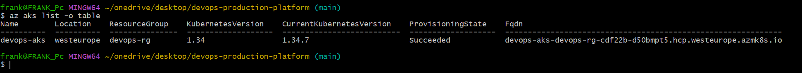

- Docker containers

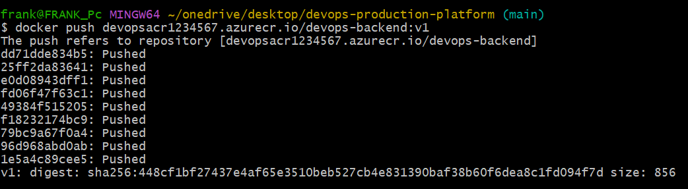

- Azure Container Registry (ACR)

- Terraform (Infrastructure as Code)

---

## ⚙️ DevOps & CI/CD

- GitHub Actions (CI/CD pipeline)

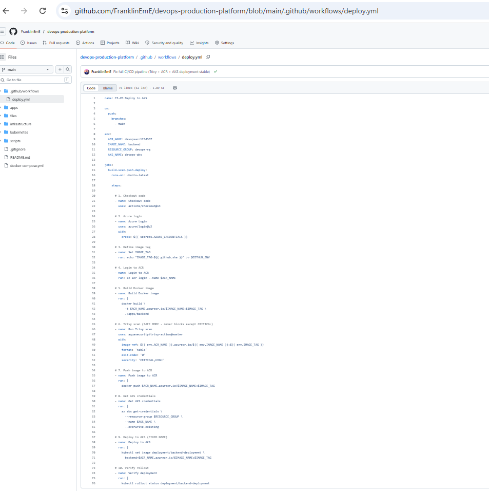

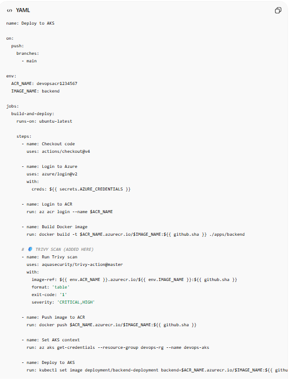

- Docker Build & Deployment

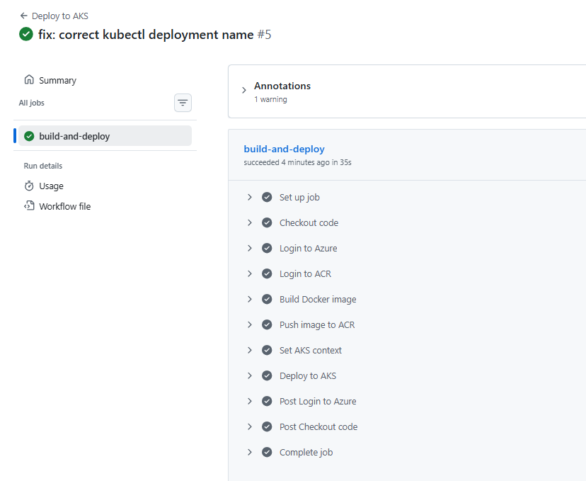

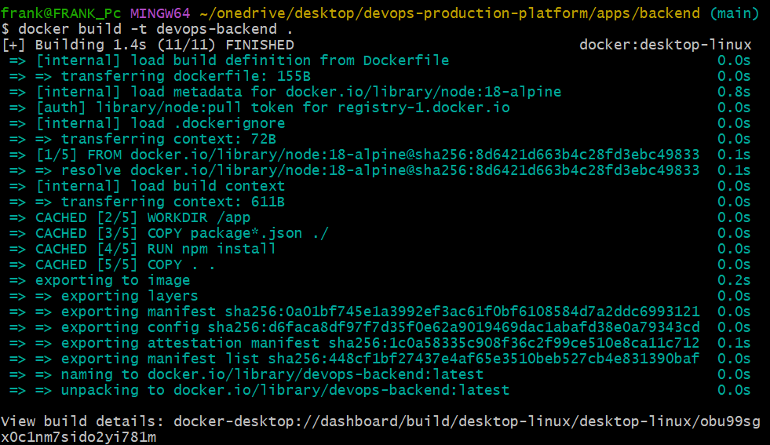

- Kubernetes Deployment

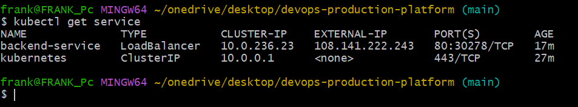

---

## 📊 Observability (Monitoring & Logging)

- Prometheus + Grafana stack

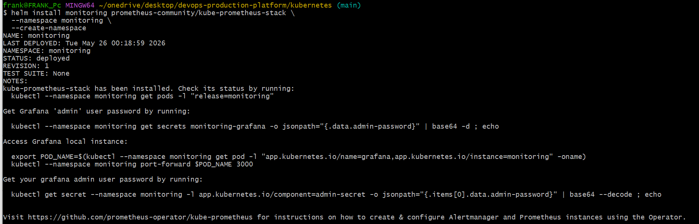

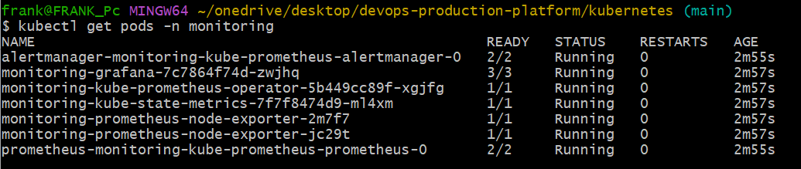

- Kubernetes system components

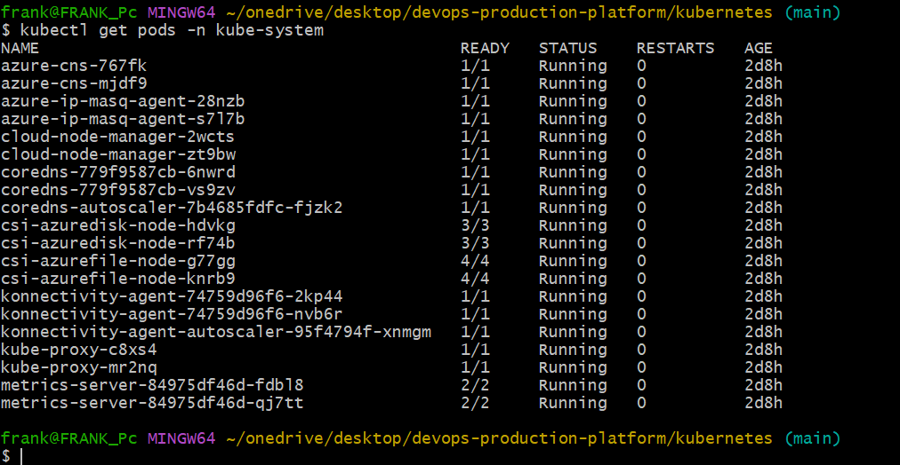

---

## 🔐 Security (DevSecOps)

- Trivy container vulnerability scanning

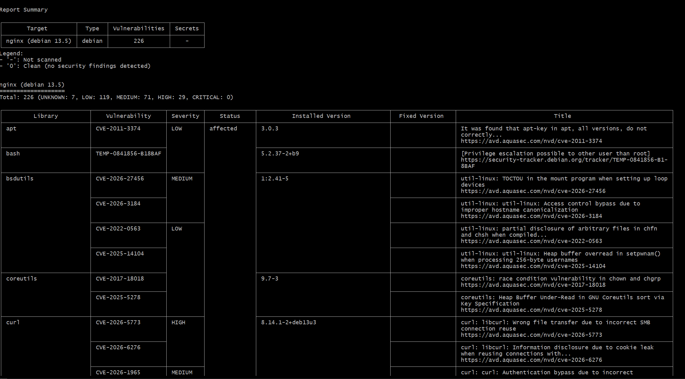

- cert-manager (TLS security)

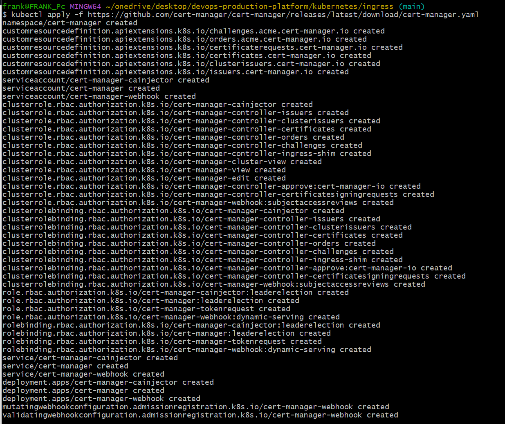

---

## 🌐 Networking & Ingress

- Ingress Controller

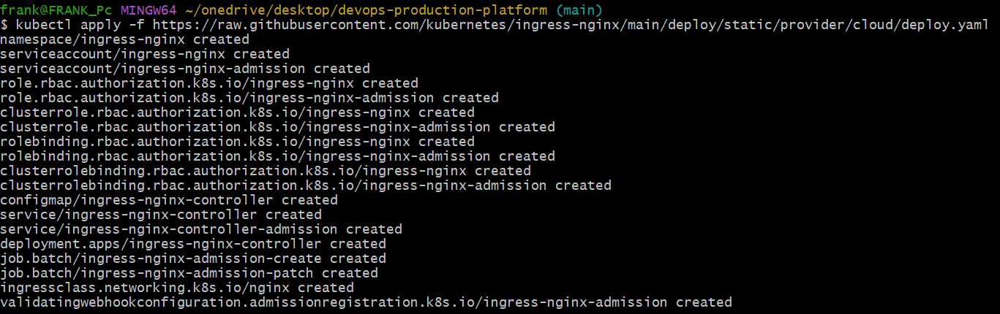

- Backend Service exposed

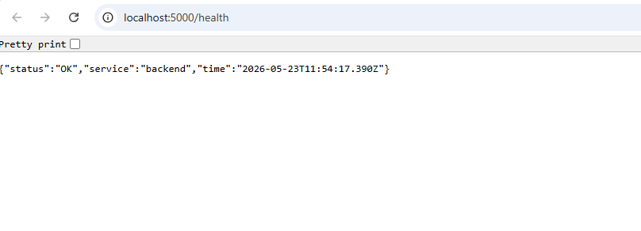

---

## 📦 Kubernetes Overview

```bash
kubectl get pods


🚀 Features
Fully containerized microservices
Kubernetes deployment (AKS)
Automated CI/CD pipeline (GitHub Actions)
Docker image build & push to ACR
Automated deployment to Kubernetes
Real-time monitoring with Grafana dashboards
Security scanning with Trivy (DevSecOps)
Scalable cloud-native architecture
⚙️ CI/CD Pipeline Flow

Every push to main triggers:

Code Checkout
Build Docker Images
Run Security Scan (Trivy)
Push Images to Azure Container Registry (ACR)
Deploy to Kubernetes (AKS)
Verify Deployment Rollout
📁 Project Structure
devops-production-platform/
│
├── apps/
├── kubernetes/
├── terraform/
├── .github/workflows/
├── Project_screenshots/
└── README.md
☸️ Kubernetes Commands
kubectl apply -f kubernetes/
kubectl get pods
kubectl get svc
📊 Monitoring Setup
helm install monitoring prometheus-community/kube-prometheus-stack \
  --namespace monitoring --create-namespace
🔐 Security (Trivy)
trivy image your-image:latest
🚀 CI/CD Example
- name: Build Docker image
  run: docker build -t $IMAGE_NAME .

- name: Push to ACR
  run: docker push $ACR_LOGIN_SERVER/$IMAGE_NAME

- name: Deploy to AKS
  run: kubectl apply -f kubernetes/
📈 What This Project Demonstrates
Real-world DevOps engineering workflow
Cloud-native architecture design
Kubernetes production deployment
CI/CD automation
Infrastructure as Code mindset
Security-first DevSecOps approach
Monitoring & observability setup
🏆 Why This Project Stands Out
Production-grade system design
End-to-end automation pipeline
Real cloud deployment (AKS)
Enterprise DevOps tooling
Scalable microservices architecture
👨‍💻 Author

Franklin Chidera Emmanuel
DevOps Engineer | Cloud & Kubernetes Enthusiast

📌 Future Improvements
ArgoCD GitOps deployment
SSL/TLS with Let's Encrypt
Multi-environment setup (dev/staging/prod)
Advanced alerting rules
Horizontal Pod Autoscaling (HPA)
